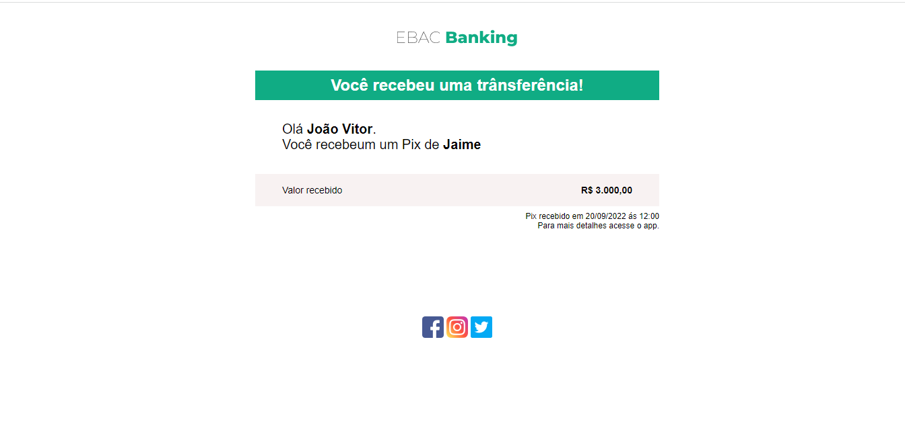
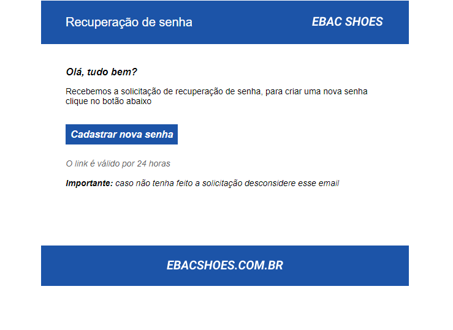
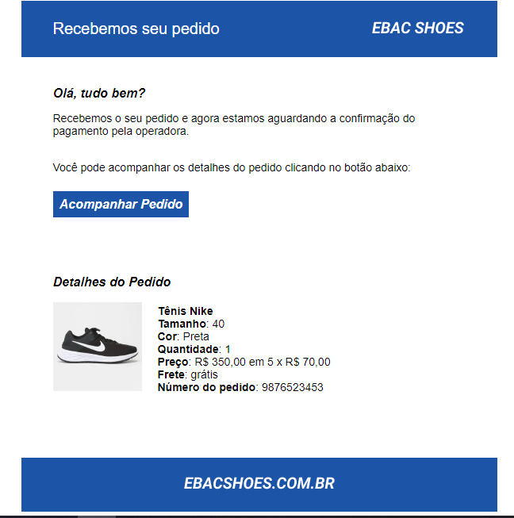
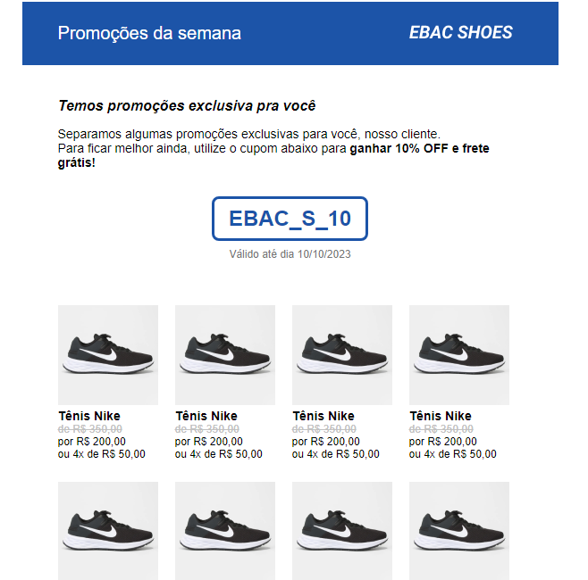
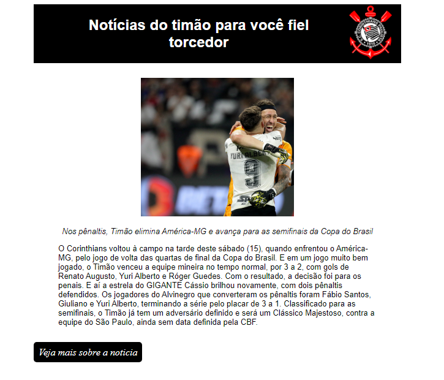

<h1 align="center">
  
<a href="https://sorteadorgruntfde95.vercel.app/">Construindo E-mails com HTML</a>

 
</h1>

# 🛠 Tecnologias utilizadas:
 

  

  

 

# 💻  Sobre o Projeto:
<li>Neste exercício, exploramos a criação de e-mails estáticos utilizando HTML e imagens, e também utilizamos o GitHub para hospedar as imagens dos e-mails. Em vez de incluir as imagens diretamente no código HTML, usamos URLs de imagem que apontam para os arquivos hospedados no GitHub. Essa abordagem nos permite ter uma melhor organização dos arquivos e facilitar o compartilhamento e o acesso aos recursos.

Como desafio de concluir o módulo, tivemos que desenvolver um e-mail para uma lista de postagens de um blog, o qual escolhi como um blog de notícias de futebol sebdo a notíca do meu time do peito o Corinthians.E além disso foi aplicado os conhecimentos adquiridos durante o módulo.</li>
 

# 🎨 Pré-visualização :
## Email-1:

## Email-2:

## Email-3:

## Email-4:

## Noticia Corinthians:

# 🦸 Autor:

 
<a href="https://www.linkedin.com/in/jo%C3%A3o-vitor-ribeiro-dias-339a56258/" target="_blank">João Vitor RIbeiro Dias</a>
